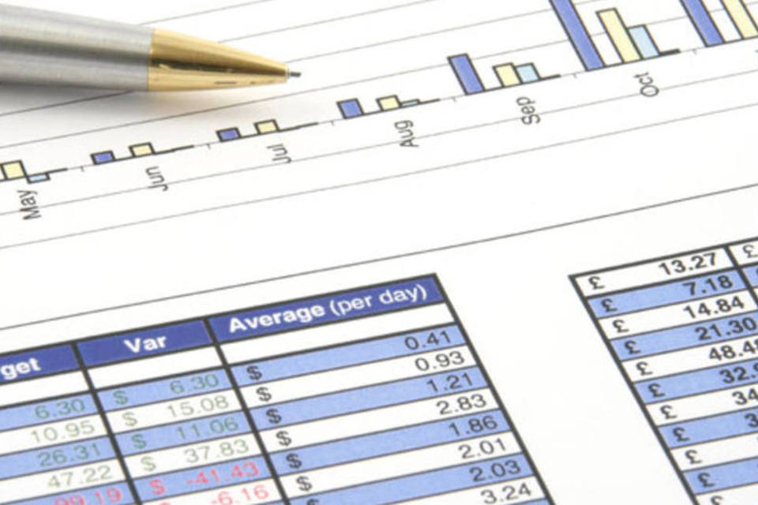
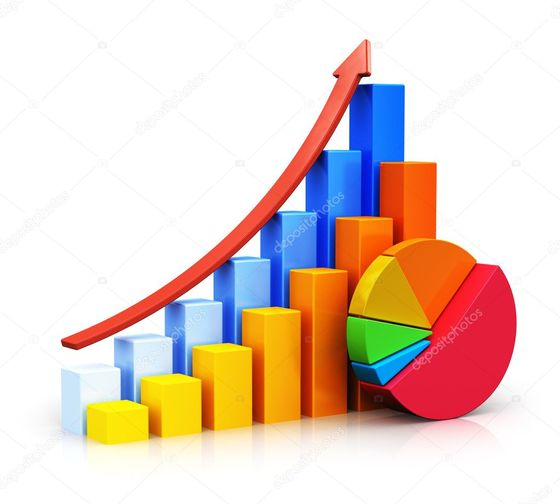

```{r setup, include=FALSE}
knitr::opts_chunk$set(echo = TRUE)
if (!require(readxl)) install.packages('readxl')
library(readxl)
```


## Grupo 

- Leonardo Oliveira
- Kawe Antônio dos Santos Marcelino
- Pedro Henrique Nunes Barros
- Rafael Nunes Caseiro
- Vitor de Souza Cruzeiro


## Introdução

 Conforme o passar dos últimos anos, a quantidade de dados aumentou de forma gigantesca. Qualquer dispositivo eletroeletrônico, capaz de ter conexão com a internet, gera ou pode gerar dados. Porém, os dados gerados, por si sós, não têm uma finalidade correta caso não sejam formatados de forma a se tornarem informação, com a qual é possivel identificar problemas ou ter uma visão melhorada da situação que gerou aqueles dados. 
 
   ```{r, echo=FALSE}
   
```
 
## Ciência de dados
 
  Os dados não estruturados alcançam escalas empresariais. Os dados estão em abundância em todos os lugares. Projeta-se que, em 2020, cada pessoa gerará cerca 1.7MB de dados por segundo. Colocando isto numa escala global e em um determinado tempo, essa quantidade de dados mostra-se difícil de ser manejada.
  Então surgiu a ciência de dados, que é uma área interdisciplinar voltada para o estudo e a análise  de dados estruturados ou não. A ciência de dados visa a extração de conhecimento para tomadas de decisão; compreende tudo relacionado à preparação, limpeza e análise de dados conforme foi visto nas aulas teóricas de ciência de dados na Universidade Estadual Paulista Julio de Mesquita Filho (UNESP) ministrada pelo professor João Pedro Albino. 
  
```{r, echo=FALSE}
   knitr::include_graphics('./Apresentacao-figure/ds.jpeg')
```

## Sobre o trabalho

  Este relatório foi realizado como parte do trabalho final da disciplina de Ciências de Dados, do segundo termo de 2018.
Ele visa demonstrar um conjunto de técnicas exploratórias da linguagem R, aprendidas durante o curso, assim como a elaboração de grafos e documentos através do software R-Studio, e o próprio relatório, em conjunto com uma apresentação de slides, produzidos pelo software R-Markdown.
  Ele contempla a pesquisa realizada pelos alunos da disciplina, aplicada ao corpo discente da Universidade Estadual Paulista "Julio de Mesquita Filho" - UNESP - do campus de Bauru - SP,  como parte da pesquisa em progresso de autoria do professor João Pedro Albino, com o intuito de responder a pergunta: <br><br><br>
"Quais são as influências das mídias sociais sobre discentes da instituição de nível superior UNESP-Bauru-SP?"
  
##Análise exploratória de dados

  Utilizando a planilha \textit{tidy} fornecida pelo professor, foram analisados todos os dados das 15 questões apresentadas nos formulários coletados. A análise foi dividida em primeira (análises isoladas das questões) e segunda grau (cruzamentos de dados entre questões para gerar informações mais complexas).
  
  ```{r, echo=FALSE}
   
```
  
##Análise de primeira ordem

A partir dos dados coletados pela pesquisa foi gerado um conjunto de gráficos exploratórios de primeira ordem. Este conjunto apresenta os resultados de forma simples e direta, servindo como embasamento inicial da análise, facilitando a proposta de perguntas mais interessantes sobre o conjunto de dados.
Ainda assim, a análise destes gráficos já aponta algumas características interessantes do corpo de pesquisa, permitindo a observação de aspectos prevalentes e possivelmente inesperados. 
  
  ```{r, echo=FALSE}
   
```
Os gráficos gerados foram os seguintes:


## Faixa etária
O gráfico a seguir apresenta a distribuição de faixa etário dos entrevistados. Percebe-se que a maioria dos entrevistados tem entre 21 e 25 anos:

```{r Faixa_Etaria, echo=FALSE, fig.align='center'}
library(readxl)
dados <- read_excel("../dados/umses_alunos_2018.xlsx") 
dados2 <- read_excel("../dados/dicionario_de_dados.xlsx")
dados <- as.data.frame(dados) #deixando como data frame
dado<- table(dados$idade)
nomes <- c("16 e 20","21 e 25","26 e 30")
barplot(dado,names.arg = nomes,ylim=c(0,40),xlab = "Idade",ylab = "Frequência",col = rainbow(3),main = "Faixa etária dos questionados")
```

## Sobre o sexo dos participantes

Uma vez que a maioria dos respondentes eram do curso de Ciência da Computação ou de Sistemas de Informação da Unesp de Bauru, é normal observar um número maior de homens, como mostra o gráfico abaixo:

```{r Sexo, echo=FALSE, fig.align='center'}
library(readxl)
library(graphics)
dados <- read_excel("../dados/umses_graduacao_2018_vtidy.xlsx")
i<- 1
for (opcao in dados$genero) {
  if (opcao == 1) {
    dados$genero<- replace(dados$genero, i, "Indefinido")
  }
  else if (opcao == 2){
    dados$genero<- replace(dados$genero, i, "Masculino")
  }
  else {
    dados$genero<- replace(dados$genero, i, "Feminino")
  }
  i<-i+1
}
genero <- table(dados$genero)
v <- round(genero/sum(genero)*100)
gen <- barplot(v,col = rainbow(2),ylim=c(0,70),xlab = "Gênero",
               ylab = "Porcentagem de pessoas",main = "Gênero dos questionados")
text(gen, v+4,paste(v,"%",sep=""))
```


## Principais motivos de uso das redes sociais
Através da análise deste dado, notou-se uma diversificação no que tange os motivos pelos quais os usuários utilizam as redes sociais.

```{r Principais_motivos_de_uso, echo=FALSE, fig.align='center'}
library(readxl)
library(graphics)
#fazendo grafico principais motivos
dados <- read_excel("../dados/umses_graduacao_2018_vtidy.xlsx")
dados <- as.data.frame(dados)
d<- c(sum(dados$contato),sum(dados$atualizado),sum(dados$preencher),sum(dados$encontrar),sum(dados$compopiniao),sum(dados$compfoto),sum(dados$amigosja),sum(dados$profnetwork),sum(dados$novaamizade),sum(dados$compdetalhe))
names(d) <- c("Contato","Atualizar","Tempo livre","Conteúdo","Opiniões","Fotos ou vídeos","Amigos","Networking","Pessoas","Compartilhar \nassuntos\nde trabalho")
par(mar = c(7,4,4,4))
grafico <- barplot(d,col=rainbow(11),las=2,
                   ylim = c(0,70),main="Principais motivos de uso",
                   ylab = "Quantidade de questionados")
text(grafico,d+6,paste(d,"",sep=""))
```

## Uso de mídias sociais por professores
Pelo menos 93% dos entrevistados concorda que as mídias sociais podem ser utilizadas por professores, mesmo que com ressalvas. Uma população muito pequena discorda da ideia e não representa um conjunto significativo para futuras análises.

```{r Uso_academico, echo=FALSE, fig.align='center'}
library(readxl)
library(graphics)
dados <- read_excel("../dados/umses_graduacao_2018_vtidy.xlsx")
d <- as.data.frame(dados)
dado <- d$usoacademico  
dado <- factor(d$usoacademico)
dado2 <- table(dado)
names(dado2) <- c("Não","Sim","Com restrições","Não sei")
par(mar = c(7,4,4,4))
dado2 <- round(dado2/sum(dado2)*100)
teste  <- barplot(dado2,cex.names=1.0,col=rainbow(11),
                  ylab="Quantidade",ylim = c(0,80),
                  main="Mídia social pode ser usada pelos professores?")
text(teste, dado2+6,paste(dado2,"%",sep="")) #add o numero em cima
```

## Mídias sociais como a melhor forma de aproximação entre professor e aluno
O gráfico apresenta as respostas à pergunta \textit{"Você acredita que a mídia social é a melhor forma dos professores se aproximarem de seus alunos?"}. Notou-se que, apesar de a maioria dos respondentes concordarem com o uso das mídias sociais na educação, ainda há muita dúvida quanto a sua real eficiência, uma vez que poucos responderam "Sim" à pergunta e muitos ficaram indecisos ou discordaram.

```{r Melhor_forma_de_aproximacao_aluno-professor, echo=FALSE, fig.align='center'}
dados <- read_excel("../dados/umses_graduacao_2018_vtidy.xlsx")
d <- as.data.frame(dados)
dado <- d$profchegaal
dado2 <- table(dado)
names(dado2) <- c("Não","Sim","Não sei")
par(mar = c(7,4,4,4))
dado2 <- round(dado2/sum(dado2)*100)
grafico <- barplot(dado2,cex.names = 1.5, col=rainbow(7),
                   las=2,ylab="Porcentagem dos questionados",
                   ylim=c(0,50),main="Melhor forma dos professores se aproximarem?")
text(grafico,dado2+5,paste(dado2,"%",sep=""))
```
 
## Mídias sociais com potencial de melhora no desempenho dos alunos
Ainda seguindo a tendência da questão anterior (que mostra que as mídias sociais ainda são um pouco "obscuras" para uso na educação), o índice de abstenção ficou próximo de um quarto dos entrevistados, mas os que concordam com a afirmação de que estes mecanismos podem melhorar o desempenho dos alunos permaneceu alto.

```{r Potencial_de_melhora, echo=FALSE, fig.align='center'}
dados <- read_excel("../dados/umses_graduacao_2018_vtidy.xlsx")
d <- as.data.frame(dados)
dado <- d$melhoraresul
dado2 <- table(dado)
names(dado2) <- c("Não","Sim","Não sei")
par(mar = c(7,4,4,4))
dado2 <- round(dado2/sum(dado2)*100)
grafico <- barplot(dado2,cex.names = 1.5, col=heat.colors(3),
                   las=2,ylab="Quantidade",
                   ylim=c(0,70),main="Melhores resultados com a integração das redes socias")
text(grafico,dado2+5,paste(dado2,"%",sep=""))
```

## Análise de segunda ordem
 <p> Enquanto que a projeção individual de resultados gera gráficos mais simples e diretos, ideais para uma primeira análise dos resultados, uma exploração mais profunda exige a elaboração de gráficos de segunda ordem, isto é, a projeção cruzada entre variáveis. </p>
  <p> Esse tipo de análise expõe correlações entre dados que dificilmente seriam percebidas de outra forma. São através destes gráficos que os aspectos mais interessantes e surpreendentes da pesquisa realizada expõem-se. </p>
  <p> Portanto, foram selecionadas diversas variáveis do corpo de dados, e, a partir destas, foi projetado um conjunto de gráficos de segunda ordem. </p>
  <p> Ao analisar estes gráficos pode-se notar que alguns não parecem transmitir nenhuma correlação relevante, com os dados cruzados se relacionando de forma dispersa. Estes gráficos não foram inclusos neste relatório. </p>
  <p> Por outro lado, as demais projeções puderam ser destacadas em dois grupos: aquelas que indicam correlação entre dados de forma a fortalecer seus resultados e outras que se relacionam de forma contraditória aos próprios resultados. Este segundo grupo em particular despertou grande interesse, pois pode ser usado para apontar aspectos da pesquisa que podem não ter sido bem interpretados pelos entrevistados, e que, portanto, possam, talvez, ser melhor elaborados. Seguem os resultados obtidos:</p>


## Resultados

Lorem ipsum dolor sit amet, consectetur adipiscing elit. Pellentesque ut augue pretium, luctus erat vitae, sollicitudin eros. Aliquam erat volutpat. Nulla facilisi. Vivamus ipsum ipsum, finibus vel venenatis non, tincidunt sit amet turpis. Aliquam aliquam purus vitae eros aliquet ullamcorper. Fusce imperdiet ut nisl tempus iaculis. Nunc vehicula, erat id vestibulum tincidunt, diam risus ullamcorper odio, quis tincidunt sapien libero sed nibh. Vivamus in velit diam. Ut nulla erat, eleifend et luctus nec, convallis id ligula. Aliquam gravida quis odio at facilisis. Suspendisse semper venenatis est, quis convallis nunc tincidunt et. Nam egestas sapien non nulla luctus iaculis. Donec vel ipsum id metus consequat aliquam. Interdum et malesuada fames ac ante ipsum primis in faucibus.